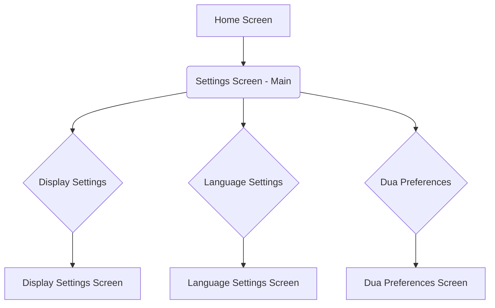

# Architectural Design Plan for Munajat App Settings

**Goal:** To create a robust, extensible, and modular settings architecture that allows for easy addition of new settings and seamless integration with future features.

**Proposed Architecture:**

We will adopt a layered approach, separating concerns between the UI, state management, data persistence, and routing. This will leverage Flutter's Provider package for state management, enhance the settings model for better organization, and introduce a dedicated settings router.

## 1. Settings Model

*   **Current State:** Individual primitive types (String, double, ThemeMode, Color, Dua, List<Dua>) are stored directly in `SettingsProvider`.
*   **Proposed Structure:**
    *   Introduce a top-level `AppSettings` class that encapsulates all application settings. This class will hold instances of smaller, feature-specific setting models (e.g., `DisplaySettings`, `NotificationSettings`, `AudioSettings`).
    *   Each feature-specific setting model will contain its relevant settings (e.g., `DisplaySettings` might have `fontSize`, `themeMode`, `textColor`).
    *   These models will be immutable (using `copyWith` for updates) to promote predictable state changes and facilitate efficient UI rebuilding.
    *   Serialization/deserialization methods (`toJson`, `fromJson`) will be implemented for each setting model to handle persistence.

**Example Structure:**

```dart
// lib/models/app_settings.dart
class AppSettings {
  final DisplaySettings displaySettings;
  final LanguageSettings languageSettings;
  final DuaPreferences duaPreferences;
  // Add more setting categories as needed

  AppSettings({
    required this.displaySettings,
    required this.languageSettings,
    required this.duaPreferences,
  });

  AppSettings copyWith({
    DisplaySettings? displaySettings,
    LanguageSettings? languageSettings,
    DuaPreferences? duaPreferences,
  }) {
    return AppSettings(
      displaySettings: displaySettings ?? this.displaySettings,
      languageSettings: languageSettings ?? this.languageSettings,
      duaPreferences: duaPreferences ?? this.duaPreferences,
    );
  }

  Map<String, dynamic> toJson() => {
        'displaySettings': displaySettings.toJson(),
        'languageSettings': languageSettings.toJson(),
        'duaPreferences': duaPreferences.toJson(),
      };

  factory AppSettings.fromJson(Map<String, dynamic> json) => AppSettings(
        displaySettings: DisplaySettings.fromJson(json['displaySettings']),
        languageSettings: LanguageSettings.fromJson(json['languageSettings']),
        duaPreferences: DuaPreferences.fromJson(json['duaPreferences']),
      );

  // Default settings
  static AppSettings initial() => AppSettings(
        displaySettings: DisplaySettings.initial(),
        languageSettings: LanguageSettings.initial(),
        duaPreferences: DuaPreferences.initial(),
      );
}

// lib/models/display_settings.dart
class DisplaySettings {
  final double arabicFontSizeMultiplier;
  final double translationFontSizeMultiplier;
  final ThemeMode selectedThemeMode;
  final int arabicTextColorValue;
  final int translationTextColorValue;

  DisplaySettings({
    required this.arabicFontSizeMultiplier,
    required this.translationFontSizeMultiplier,
    required this.selectedThemeMode,
    required this.arabicTextColorValue,
    required this.translationTextColorValue,
  });

  DisplaySettings copyWith({
    double? arabicFontSizeMultiplier,
    double? translationFontSizeMultiplier,
    ThemeMode? selectedThemeMode,
    int? arabicTextColorValue,
    int? translationTextColorValue,
  }) {
    return DisplaySettings(
      arabicFontSizeMultiplier: arabicFontSizeMultiplier ?? this.arabicFontSizeMultiplier,
      translationFontSizeMultiplier: translationFontSizeMultiplier ?? this.translationFontSizeMultiplier,
      selectedThemeMode: selectedThemeMode ?? this.selectedThemeMode,
      arabicTextColorValue: arabicTextColorValue ?? this.arabicTextColorValue,
      translationTextColorValue: translationTextColorValue ?? this.translationTextColorValue,
    );
  }

  Map<String, dynamic> toJson() => {
        'arabicFontSizeMultiplier': arabicFontSizeMultiplier,
        'translationFontSizeMultiplier': translationFontSizeMultiplier,
        'selectedThemeMode': selectedThemeMode.index,
        'arabicTextColorValue': arabicTextColorValue,
        'translationTextColorValue': translationTextColorValue,
      };

  factory DisplaySettings.fromJson(Map<String, dynamic> json) => DisplaySettings(
        arabicFontSizeMultiplier: json['arabicFontSizeMultiplier'],
        translationFontSizeMultiplier: json['translationFontSizeMultiplier'],
        selectedThemeMode: ThemeMode.values[json['selectedThemeMode']],
        arabicTextColorValue: json['arabicTextColorValue'],
        translationTextColorValue: json['translationTextColorValue'],
      );

  static DisplaySettings initial() => DisplaySettings(
        arabicFontSizeMultiplier: 1.0,
        translationFontSizeMultiplier: 1.0,
        selectedThemeMode: ThemeMode.system,
        arabicTextColorValue: Colors.black.value,
        translationTextColorValue: Colors.black87.value,
      );
}

// Similar models for LanguageSettings, DuaPreferences, etc.
```

## 2. Settings Provider

*   **Current State:** `SettingsProvider` extends `ChangeNotifier` and directly manages individual setting properties, saving them to `shared_preferences` on every change.
*   **Proposed Approach:**
    *   Maintain `ChangeNotifier` for simplicity and compatibility with existing Provider usage.
    *   The `SettingsProvider` will now hold a single instance of `AppSettings`.
    *   All setting modifications will involve creating a new `AppSettings` instance using `copyWith` and then notifying listeners.
    *   **Persistence:** Continue using `shared_preferences` for now, but abstract the persistence logic into a `SettingsRepository` class. This makes it easy to switch to `Hive` or `SQLite` later without affecting the `SettingsProvider`.
    *   The `SettingsRepository` will handle saving and loading the `AppSettings` object (serialized to JSON).

**Example Provider Structure:**

```dart
// lib/providers/settings_provider.dart
import 'package:flutter/material.dart';
import '../models/app_settings.dart';
import '../services/settings_repository.dart'; // New repository

class SettingsProvider extends ChangeNotifier {
  AppSettings _appSettings;
  final SettingsRepository _repository;

  SettingsProvider(this._repository) : _appSettings = AppSettings.initial() {
    _loadSettings();
  }

  AppSettings get appSettings => _appSettings;

  // Generic update method for any setting
  void updateSettings(AppSettings newSettings) {
    _appSettings = newSettings;
    notifyListeners();
    _repository.saveSettings(_appSettings);
  }

  // Specific setters for UI to interact with
  void setArabicFontSizeMultiplier(double multiplier) {
    updateSettings(_appSettings.copyWith(
      displaySettings: _appSettings.displaySettings.copyWith(arabicFontSizeMultiplier: multiplier),
    ));
  }

  void setSelectedLanguage(String language) {
    updateSettings(_appSettings.copyWith(
      languageSettings: _appSettings.languageSettings.copyWith(selectedLanguage: language),
    ));
  }

  // ... other setters

  Future<void> _loadSettings() async {
    _appSettings = await _repository.loadSettings();
    notifyListeners();
  }
}

// lib/services/settings_repository.dart
import 'dart:convert';
import 'package:shared_preferences/shared_preferences.dart';
import '../models/app_settings.dart';

class SettingsRepository {
  static const String _settingsKey = 'app_settings';

  Future<AppSettings> loadSettings() async {
    final prefs = await SharedPreferences.getInstance();
    final String? settingsJson = prefs.getString(_settingsKey);
    if (settingsJson != null) {
      return AppSettings.fromJson(jsonDecode(settingsJson));
    }
    return AppSettings.initial(); // Return default settings if none found
  }

  Future<void> saveSettings(AppSettings settings) async {
    final prefs = await SharedPreferences.getInstance();
    await prefs.setString(_settingsKey, jsonEncode(settings.toJson()));
  }
}
```

## 3. Settings Router/Navigation

*   **Current State:** `settings_screen.dart` is a single, monolithic screen.
*   **Proposed Approach:**
    *   Implement a hierarchical navigation structure for settings.
    *   Use Flutter's built-in `Navigator` or a routing package like `GoRouter` (if more complex routing is needed across the app). For simplicity, we'll assume `Navigator` for now.
    *   The main `SettingsScreen` will act as a hub, listing categories (e.g., "Display", "Language", "Dua Preferences").
    *   Tapping a category will navigate to a dedicated sub-screen for that category (e.g., `DisplaySettingsScreen`, `LanguageSettingsScreen`).
    *   This promotes modularity and keeps individual setting screens focused.

**Navigation Flow:**



## 4. UI Integration

*   **Current State:** `settings_screen.dart` directly uses `Consumer<SettingsProvider>` and builds all UI elements within a single widget.
*   **Proposed Approach:**
    *   The main `SettingsScreen` will list setting categories.
    *   Each category will be a `ListTile` or similar widget that navigates to its respective sub-screen.
    *   Sub-screens (e.g., `DisplaySettingsScreen`) will use `Consumer` or `Selector` to listen only to the specific part of `AppSettings` they need (e.g., `settingsProvider.appSettings.displaySettings`). This optimizes rebuilds.
    *   UI widgets for individual settings (e.g., font size slider, theme dropdown) will call the specific setter methods on `SettingsProvider` (e.g., `settingsProvider.setArabicFontSizeMultiplier`).

**Example UI Integration:**

```dart
// lib/screens/settings_screen.dart (Main hub)
class SettingsScreen extends StatelessWidget {
  @override
  Widget build(BuildContext context) {
    return Scaffold(
      appBar: AppBar(title: Text('Settings')),
      body: ListView(
        children: [
          ListTile(
            leading: Icon(Icons.display_settings),
            title: Text('Display Settings'),
            onTap: () {
              Navigator.of(context).push(MaterialPageRoute(builder: (_) => DisplaySettingsScreen()));
            },
          ),
          ListTile(
            leading: Icon(Icons.language),
            title: Text('Language Settings'),
            onTap: () {
              Navigator.of(context).push(MaterialPageRoute(builder: (_) => LanguageSettingsScreen()));
            },
          ),
          // ... other categories
        ],
      ),
    );
  }
}

// lib/screens/display_settings_screen.dart (Sub-screen)
class DisplaySettingsScreen extends StatelessWidget {
  @override
  Widget build(BuildContext context) {
    return Scaffold(
      appBar: AppBar(title: Text('Display Settings')),
      body: Consumer<SettingsProvider>(
        selector: (context, provider) => provider.appSettings.displaySettings,
        builder: (context, displaySettings, child) {
          final settingsProvider = Provider.of<SettingsProvider>(context, listen: false);
          return Column(
            children: [
              // Arabic Font Size Slider
              Text('Arabic Font Size: ${displaySettings.arabicFontSizeMultiplier}'),
              Slider(
                value: displaySettings.arabicFontSizeMultiplier,
                min: 0.8,
                max: 1.5,
                onChanged: (newValue) {
                  settingsProvider.setArabicFontSizeMultiplier(newValue);
                },
              ),
              // ... other display settings
            ],
          );
        },
      ),
    );
  }
}
```

## 5. Extensibility

*   **Modular Settings Models:** To add a new setting category (e.g., `AudioSettings`):
    1.  Create a new model class: `lib/models/audio_settings.dart`.
    2.  Add an instance of `AudioSettings` to the `AppSettings` class.
    3.  Update `AppSettings.toJson()` and `AppSettings.fromJson()` to include the new model.
    4.  Add a new setter method in `SettingsProvider` (e.g., `setVolume(double volume)`).
    5.  Create a new settings sub-screen: `lib/screens/audio_settings_screen.dart`.
    6.  Add a `ListTile` to the main `SettingsScreen` to navigate to `AudioSettingsScreen`.
*   **Adding Individual Settings:** To add a new setting within an existing category (e.g., `enableDarkMode` in `DisplaySettings`):
    1.  Add the new property to the `DisplaySettings` model.
    2.  Update `DisplaySettings.copyWith()`, `toJson()`, and `fromJson()`.
    3.  Add a new setter method in `SettingsProvider` (e.g., `toggleDarkMode(bool value)`).
    4.  Add the corresponding UI widget to `DisplaySettingsScreen`.

This modular approach ensures that changes are localized to specific setting models and screens, minimizing refactoring.

## 6. Seamless Integration

*   **Feature-Specific Settings:** When developing a new feature (e.g., "Prayer Times"), its settings can be integrated by:
    1.  Creating a `PrayerTimeSettings` model.
    2.  Adding it to `AppSettings`.
    3.  Creating a `PrayerTimeSettingsScreen`.
    4.  Adding a navigation entry in the main `SettingsScreen`.
*   **Accessing Settings:** Any part of the application can access settings by using `Provider.of<SettingsProvider>(context).appSettings.displaySettings.arabicFontSizeMultiplier` or by using `Consumer` for reactive updates. This centralized `AppSettings` object provides a single source of truth for all configurations.

## 7. High-Level Diagram

```mermaid
graph TD
    A[Home Screen] --> B(Settings Screen - Main)
    B --> C{Display Settings}
    B --> D{Language Settings}
    B --> E{Dua Preferences}
    C --> C1[Display Settings Screen]
    D --> D1[Language Settings Screen]
    E --> E1[Dua Preferences Screen]