# OasisMM Database Schema Map

## Entity Relationship Diagram

```mermaid
erDiagram
    %% QURAN CORE
    surahs ||--o{ verses : contains
    surahs ||--o{ translations : has
    surahs ||--o{ surah_info : has
    surahs ||--o{ quran_sajda : has
    
    surahs {
        int id PK
        text name
        text name_transliteration
        text revelation_type
        int total_verses
    }
    
    verses {
        int id PK
        int surah_id FK
        int verse_number
        text text_arabic
        text text_tajweed
        text text_tajweed_indopak
    }
    
    translations {
        int id PK
        int surah_id FK
        int verse_number
        text translator_key
        text text
    }
    
    surah_info {
        int id PK
        int surah_id FK
        text language
        text content
    }

    %% QURAN METADATA
    quran_ayah_metadata {
        int id PK
        int surah_id
        int verse_number
        int juz
        int hizb
        int rub
        int page
    }
    
    quran_sajda {
        int id PK
        int surah_id
        int verse_number
        text sajda_type
    }
    
    quran_juz {
        int id PK
        text data
    }
    
    quran_hizb {
        int id PK
        text data
    }

    %% HADITH
    hadith_books ||--o{ hadith_chapters : contains
    hadith_books ||--o{ hadiths : contains
    hadith_chapters ||--o{ hadiths : contains
    
    hadith_books {
        int id PK
        text book_key
        text name_arabic
        text name_english
        text author_arabic
        text author_english
        int total_hadiths
    }
    
    hadith_chapters {
        int id PK
        int book_id FK
        int chapter_number
        text name_arabic
        text name_english
    }
    
    hadiths {
        int id PK
        int book_id FK
        int chapter_id FK
        text hadith_number
        text text_arabic
        text text_english
        text text_myanmar
        text narrator_english
        text narrator_myanmar
        text grade
        text reference
    }

    %% QURAN FONTS & LAYOUT
    indopak_words {
        int id PK
        int surah
        int ayah
        int word
        text text
        text char_type
        text text_tajweed
    }

    qpc_glyphs {
        int id PK
        int surah
        int ayah
        int word
        int page
        int line
        text text
        text glyph_code
    }

    mashaf_pages {
        int id PK
        int page_number
        int surah
        int ayah
        int line
        real x_position
        real y_position
        real width
        real height
        text data_json
    }

    %% RELATIONSHIPS (FONTS)
    indopak_words }o--|| surahs : refers
    qpc_glyphs }o--|| surahs : refers
    mashaf_pages }o--|| surahs : refers

    %% SUNNAH
    sunnah_chapters ||--o{ sunnah_items : contains
    
    sunnah_book_info {
        int id PK
        text title
        text author
        text publisher
        text language
        text edition
    }
    
    sunnah_chapters {
        int id PK
        int chapter_number
        text title
    }
    
    sunnah_items {
        int id PK
        int chapter_id FK
        int item_number
        text text
        text arabic_text
        text urdu_translation
        text references_json
    }

    %% DUA & DHIKR
    dua_categories ||--o{ duas : contains
    
    dua_categories {
        int id PK
        text category_key
        text name
        text description
    }
    
    duas {
        int id PK
        int category_id FK
        text language
        text title
        text arabic_text
        text transliteration
        text translation
        text reference
        text benefits
        int repeat_count
    }

    %% STANDALONE
    allah_names {
        int id PK
        text arabic
        text english
        text urdu_meaning
        text english_meaning
        text english_explanation
    }
    
    munajat {
        int id PK
        text category
        text title
        text arabic_text
        text transliteration
        text translation
        text reference
        text data_json
    }
    
    tafseer {
        int id PK
        int surah_id
        int verse_start
        int verse_end
        text language
        text source
        text text
    }

    indopak_glyphs {
        int id PK
        text location
        int surah
        int ayah
        int word
        text text_tajweed
    }
```



## Table Summary

| Category | Tables | Purpose |
|----------|--------|---------|
| **Quran Core** | `surahs`, `verses`, `translations`, `surah_info` | Quran text + translations |
| **Quran Metadata** | `quran_ayah_metadata`, `quran_sajda`, `quran_juz`, `quran_hizb`, `quran_ruku`, `quran_manzil`, `quran_rub` | Navigation & divisions |
| **Tafseer** | `tafseer` | Ibn Kathir Tafseer (en/mm) |
| **Hadith** | `hadith_books`, `hadith_chapters`, `hadiths` | 9 hadith collections |
| **Sunnah** | `sunnah_book_info`, `sunnah_chapters`, `sunnah_items` | Sunnah collection |
| **Dua** | `dua_categories`, `duas` | Dua & Dhikr content |
| **Other** | `allah_names`, `munajat` | Standalone content |
| **Font & Layout** | `indopak_glyphs`, `indopak_words`, `qpc_glyphs`, `mashaf_pages` | Font data and Mushaf line layout |
| **System** | `_migration_info`, `verses_fts`, `translations_fts` | Metadata & search |

## Key Relationships

1. **Quran**: `surahs` → `verses` → `translations` (1:many:many)
2. **Hadith**: `hadith_books` → `hadith_chapters` → `hadiths` (1:many:many)
3. **Sunnah**: `sunnah_chapters` → `sunnah_items` (1:many)
4. **Dua**: `dua_categories` → `duas` (1:many)

## Full-Text Search Tables

- `verses_fts` - Search Arabic Quran text
- `translations_fts` - Search translation text

## Common Queries

```sql
-- Get verse with translation
SELECT v.text_arabic, t.text as translation
FROM verses v
JOIN translations t ON v.surah_id = t.surah_id AND v.verse_number = t.verse_number
WHERE v.surah_id = 1 AND t.translator_key = 'mya-basein';

-- Search translations
SELECT * FROM translations_fts WHERE text MATCH 'keyword';

-- Get hadith by book
SELECT h.*, c.name_english as chapter
FROM hadiths h
JOIN hadith_chapters c ON h.chapter_id = c.id
JOIN hadith_books b ON h.book_id = b.id
WHERE b.book_key = 'bukhari';
```
